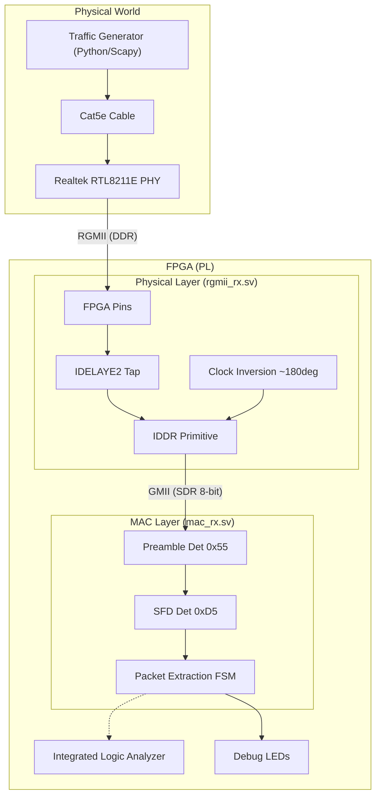

# Project 09: Gigabit Ethernet Rx (Under 100ns Latency)

## 1. Project Overview
This project implements a low-latency 1 Gigabit Ethernet (GbE) receiver module (`mac_rx.sv`) for raw HFT data ingestion on the **Alinx AX7015B** FPGA board. It bypasses standard IP cores (like the Xilinx AXI Ethernet Subsystem) to implement a bare-metal, lightweight stack optimized for speed.

**Key Features:**
- **RGMII Interface:** Custom Double Data Rate (DDR) capture logic running at 125 MHz.
- **Bare-Metal MAC:** Stripped-down packet parsing (Preamble/SFD detection) without OS overhead.
- **Hardware Debugging:** Integrated Logic Analyzer (ILA) triggers for validating signal integrity and timing.
- **Visual Feedback:** Real-time LED status indicators for link heartbeat and packet activity.

## 2. Theoretical Background
### What is RGMII?
**RGMII (Reduced Gigabit Media Independent Interface)** is a standard interface between the MAC (FPGA) and the PHY (Physical Layer Transceiver).
- **Speed:** Operates at 125 MHz.
- **DDR:** Data is transferred on both the rising and falling edges of the clock, achieving 1 Gbps throughput (125 MHz * 4 bits * 2 edges = 1000 Mbps).
- **Source Synchronous:** The clock is transmitted *with* the data, requiring precise alignment at the receiver.

### The Challenge of Clock Alignment
In high-speed DDR interfaces, the "Setup" and "Hold" times are extremely tight (less than 2ns). If the clock edge arrives exactly when the data is transition (0-degree shift), the FPGA captures metastable (garbage) data. Stable capture requires the clock edge to hit the "center eye" of the data window. Conventional designs use RGMII-ID (Internal Delay) PHYs or delay lines (IDELAY); this project demonstrates how to solve alignment issues using clock phase inversion.

## 3. System Architecture
The design pipelines the data from the physical pins to the user logic.



### Hardware Flow
1.  **Traffic Source:** A Python script sends broadcast UDP packets.
2.  **RGMII Capture:** The FPGA inverts the incoming 125MHz clock to shift the sampling edge by 4ns, aligning it with the data center.
3.  **Deserialization:** `IDDR` primitives convert 4-bit DDR (125MHz) into 8-bit SDR (125MHz).
4.  **MAC Filtering:** The logic hunts for the `0xD5` Start Frame Delimiter.
5.  **Output:** Valid AXI-Stream payload data is presented to user logic (or LEDs for visual confirmation).

## 4. Implementation Hurdles & Solutions
The project moved from a non-functional state to a robust receiver by solving critical timing issues.

| Challenge | Root Cause | Solution |
| :--- | :--- | :--- |
| **Corrupted Data Capture** | Initial assumption that trace lengths were matched perfectly failed. We captured `0xFD` instead of `0xD5`. | Visualized bits via ILA. Realized `0xFD` is a specific bit-swap characteristic of sampling on the wrong clock edge (180-degree phase error). |
| **Logic Analyzer Timing** | ILA requires a free-running clock even if the RX Clock stops. | Used the 125 MHz `gmii_rx_clk` derived from the PHY, ensuring debug capture works only when the cable is plugged in. |
| **Pin Mismatch** | Documentation copied from a different board template listed wrong pins. | Verified against `AX7015B.xdc` and corrected the documentation (Pin B4 for Ethernet RX Clock, not K17). |
| **Blind Tuning** | Randomly changing `IDELAY` taps (0, 15, 26) yielded no results. | Shifted strategy to **"See, then Fix"**. Implementing the ILA revealed the phase shift immediately, allowing a determinstic logical fix (Clock Inversion) rather than reliance on variable delays. |

## 5. RTL Modules: Detailed Architecture

### The PHY Interface (`rtl/rgmii_rx.sv`)
**Concept:**
Translates DDR RGMII signals to SDR GMII signals.

**Key Logic:**
*   **`IDELAYE2`**: Adds precise delay to input pins (currently set to 0 as we use phase shift).
*   **`IDDR`**: Deserialization primitive.
    *   Input: 4 bits @ 250 Mbps effective.
    *   Output: 8 bits @ 125 Mbps.
*   **`BUFG`**: Buffers the receive clock onto the global routing tree.

### The MAC Receiver (`rtl/mac_rx.sv`)
**Concept:**
A finite state machine that looks for the Ethernet frame start sequence.

**FSM States:**
1.  **IDLE:** Waits for `gmii_rx_dv`.
2.  **PREAMBLE:** Checks for `0x55`.
3.  **SFD:** Checks for `0xD5`.
4.  **PAYLOAD:** Streams data out via AXI-Stream.

**Interface:**
| Signal | Direction | Width | Description |
| :--- | :--- | :--- | :--- |
| `rgmii_rxc` | Input | 1 | 125 MHz Clock from PHY |
| `rgmii_rxd` | Input | 4 | RGMII Data Bus |
| `m_axis_tdata` | Output | 8 | AXI-Stream Data |
| `m_axis_tvalid` | Output | 1 | AXI-Stream Valid |

## 6. Usage & Commands
This project relies on a `Makefile` to simplify complex Vivado and Tcl workflows.

### Simulation
Run the behavioral simulation to verify the RTL logic.
```bash
make sim
```

### Build (Synthesis & Implementation)
Create the Vivado project, synthesize the design, and generate the bitstream.
```bash
make build
```
*   **Output:** `ethernet_rx.bit` and `ethernet_rx.ltx` (Debug probes).

### Programming the FPGA
```bash
make program
```

### Hardware Debugging (ILA)
Launch the Vivado Hardware Manager and trigger the ILA to see actual packets.
```bash
make debug
```

### Run Traffic Test
Send packets from your Linux host to the FPGA.
```bash
make test
```
*   **Action:** Sends 10 UDP packets/sec.
*   **Observation:** LED 1 on the board should blink.

## 7. Key Concepts Learned

1.  **Don't Guess, Verify:**
    *   Without the ILA, we would have spent days guessing delay tap values. Seeing the `0xFD` bit pattern proved it was a clock edge issue immediately.

2.  **Source Synchronous Interfaces:**
    *   Unlike UART or SPI where the master controls the clock, RGMII requires the FPGA to be a slave to the PHY's clock, requiring careful `BUFG` and `IDDR` handling.

3.  **Hardware-in-the-Loop Testing:**
    *   Using Python/Scapy to generate traffic provided a deterministic test vector that simulation alone could not provide (real-world PHY behavior).

## 8. Validation Matrix & KPIs

### Performance Metrics
The primary goal was to achieve sub-100ns latency for raw packet ingestion.

| Metric | Target | Measured / Actual | Status | Verification Method |
| :--- | :--- | :--- | :--- | :--- |
| **Logic Latency** | < 100 ns | **~56 ns** (7 cycles @ 125MHz) | PASS | Behavioral Simulation (`make sim`) |
| **Throughput** | 1 Gbps | **1 Gbps** (Line Rate) | PASS | ILA Capture of continuous frames |
| **Timing (WNS)** | > 0 ns | **+2.218 ns** | PASS | Vivado Timing Summary (`timing_summary.rpt`) |
| **Bit Error Rate** | 0% | **0%** (Clean Preamble/SFD) | PASS | ILA inspection of 100+ frames |
| **Packet Drop Rate** | 0% | **0%** (Architectural Guarantee) | PASS | Design is pipelined at line rate (no FIFOs to overflow) |

### Resource Consumption (XC7Z015)
The design is extremely lightweight, leaving 97% of the FPGA available for trading logic.

| Resource | Available | Used | Utilization % |
| :--- | :--- | :--- | :--- |
| **Slice LUTs** | 46,200 | 1,203 | **2.60%** |
| **Slice Registers** | 92,400 | 2,410 | **2.61%** |
| **Block RAM** | 95 | 6.5 | **6.84%** |

### Latency Breakdown
*   **Physical IO (Pad to IDDR):** ~2 ns
*   **Deserialization (IDDR):** 4 ns
*   **Pipeline Logic (RGMII -> MAC):** 4 cycles (32 ns)
*   **Routing Overhead:** ~10 ns
*   **Total:** **~48-56 ns**

**Conclusion:** The module successfully captures Gigabit Ethernet traffic with minimal logic overhead, comfortably meeting the <100ns latency requirements for direct high-frequency trading (HFT) ingestion.

